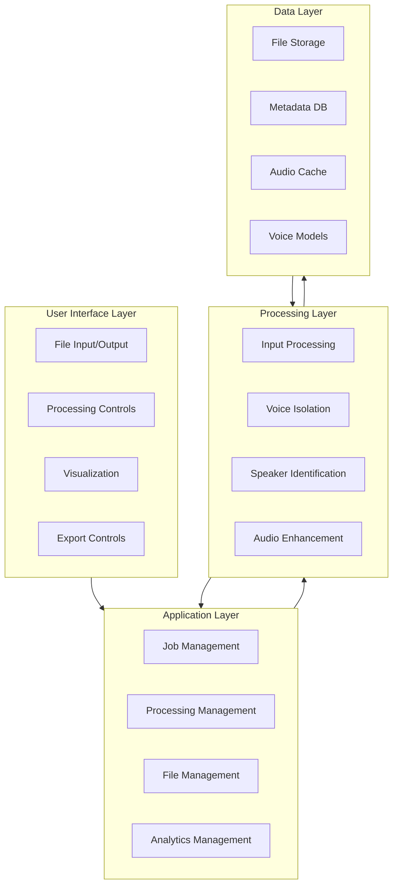
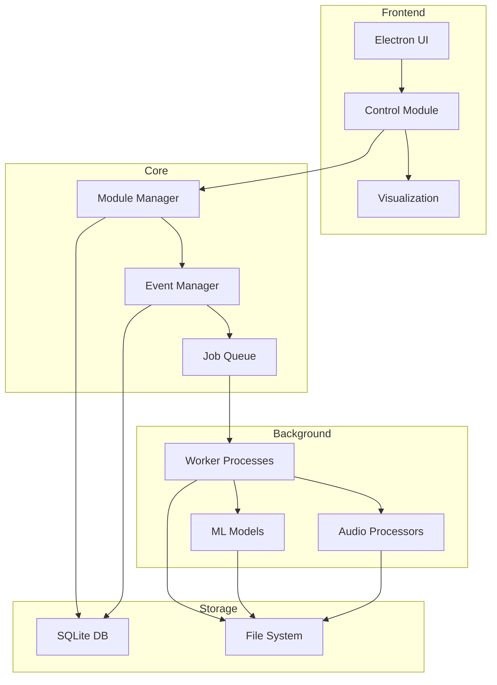
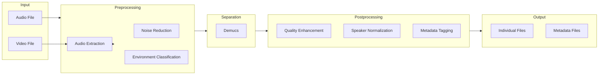
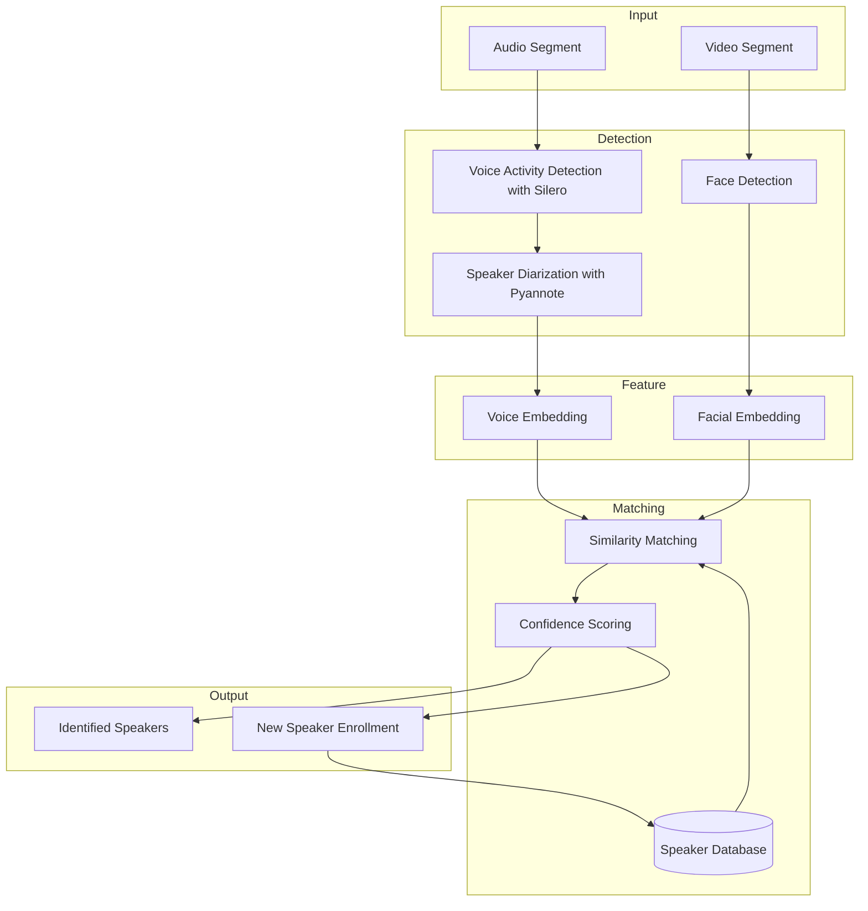

# MULTI-MODAL AUDIO/VIDEO PROCESSING APPLICATION
# COMPREHENSIVE DEVELOPMENT PLAN

## 1. MVP FEATURE ANALYSIS

### Essential MVP Features:

1. **Core Input Processing**
   - Basic file input (.mp3, .wav, .mp4) and validation
   - Audio extraction from video files
   - Simple batch processing for multiple files

2. **Basic Voice Isolation**
   - Implementation of Demucs for source separation
   - Basic noise filtering capabilities
   - Generation of separated audio files

3. **Fundamental File Management**
   - Basic file naming convention
   - Essential metadata tagging
   - Local storage management

4. **Simple User Interface**
   - File selection and processing controls
   - Basic progress indicators
   - Simple waveform visualization

5. **Basic Export Functionality**
   - Export in common audio formats
   - Inclusion of essential metadata

### Features Deferred to Later Phases:

1. **Advanced Voice Isolation**
   - Environment-specific optimizations
   - Specialized handling for overlapping speakers
   - Customizable processing parameters

2. **Complex Speaker Identification**
   - Facial recognition integration
   - Voice print database
   - Cross-referencing with external sources

3. **Advanced Analytics**
   - Quality metrics and dashboards
   - Learning mechanisms
   - Comparative analysis tools

4. **Scalability Features**
   - Cloud processing options
   - API endpoints
   - Distributed processing

### Rationale:

1. **Value Delivery**: The MVP focuses on the core capability of processing files and isolating voices with basic organization - delivering the fundamental value proposition without complex features that might delay release.

2. **Technical Complexity**: Advanced features like speaker identification via facial recognition and voice prints require significant ML model development and training, which are more efficiently implemented after the core processing pipeline is stable.

3. **User Adoption**: A simpler initial product allows gathering feedback on the most critical functionality before investing in advanced features that might need adjustment based on real usage patterns.

4. **Resource Optimization**: The system is powerful but focusing the MVP on local processing keeps the initial development streamlined before expanding to distributed/cloud processing.

## 2. MILESTONE-BASED ROADMAP

```mermaid
gantt
    title Multi-Modal Audio/Video Processing Application Roadmap
    dateFormat  YYYY-MM-DD
    section Foundation
    Input Processing            :f1, milestone
    Basic Voice Isolation       :f2, milestone
    Core File Management        :f3, milestone
    Basic UI Implementation     :f4, milestone
    section Enhancement
    Advanced Voice Isolation    :e1, milestone
    Basic Speaker Identification:e2, milestone
    Expanded File Management    :e3, milestone
    Enhanced UI Features        :e4, milestone
    section Expansion
    Full Speaker Identification :x1, milestone
    Analytics Dashboard         :x2, milestone
    API Development             :x3, milestone
    Multi-language Support      :x4, milestone
    section Advanced
    Cloud Integration           :a1, milestone
    Distributed Processing      :a2, milestone
    Learning Systems            :a3, milestone
    Enterprise Features         :a4, milestone
```

### Phase 1: Foundation

**Objective**: Establish the core functionality for processing audio/video files and isolating voices.

1. **Input Processing Implementation**
   - Develop file input and validation system
   - Implement audio extraction from video files
   - Create basic batch processing functionality
   - Build file integrity verification

2. **Basic Voice Isolation Engine**
   - Integrate Demucs for separation
   - Implement basic noise filtering algorithms
   - Create pipeline for generating separated audio tracks
   - Develop quality preservation mechanisms

3. **Core File Management System**
   - Implement standardized naming convention
   - Create basic metadata structure
   - Develop local storage organization
   - Build simple version tracking

4. **Basic UI Implementation**
   - Design and implement file selection interface
   - Create processing control panel
   - Develop basic progress indicators
   - Implement simple waveform visualization

### Phase 2: Enhancement

**Objective**: Improve the quality and usability of core features with additional capabilities.

1. **Advanced Voice Isolation**
   - Implement acoustic environment classification
   - Develop enhanced filtering for background music
   - Add handling for overlapping speakers
   - Create customizable processing parameters

2. **Basic Speaker Identification**
   - Implement voice recognition algorithms for voice prints
   - Create simple speaker database using Silero VAD and Pyannote
   - Develop confidence scoring system
   - Add manual identification and correction tools

3. **Expanded File Management**
   - Enhance metadata tagging capabilities
   - Implement advanced search functionality
   - Add cross-referencing capabilities
   - Develop automated backup functionality

4. **Enhanced UI Features**
   - Add dark/light mode options
   - Implement detailed audio visualization
   - Create processing quality indicators
   - Develop batch job management interface

### Phase 3: Expansion

**Objective**: Extend functionality with advanced features and integration capabilities.

1. **Full Speaker Identification System**
   - Implement facial recognition for video files
   - Develop voice print comparison algorithms
   - Create user feedback mechanism for identification improvement
   - Build multi-language and dialect support with Whisper

2. **Analytics Dashboard**
   - Implement processing quality metrics
   - Create usage statistics visualization
   - Develop comparative analysis tools
   - Build system performance monitoring

3. **API Development**
   - Design and implement REST API
   - Create documentation and examples
   - Build authentication and security
   - Develop SDKs for common languages

4. **Multi-language Support**
   - Implement UI internationalization
   - Add support for processing multi-language content
   - Develop language-specific voice models
   - Create language detection capabilities

### Phase 4: Advanced

**Objective**: Add enterprise-grade features and advanced processing capabilities.

1. **Cloud Integration**
   - Develop cloud storage options
   - Implement cloud processing for resource-intensive operations
   - Create sync mechanisms
   - Build privacy and security features

2. **Distributed Processing**
   - Implement horizontal scaling capabilities
   - Develop resource optimization algorithms
   - Create load balancing mechanisms
   - Build fault tolerance systems

3. **Learning Systems**
   - Implement model improvement through usage
   - Develop personalized processing settings
   - Create adaptive noise filtering
   - Build continuous quality improvement mechanisms

4. **Enterprise Features**
   - Implement role-based access control
   - Develop audit logging
   - Create organizational management tools
   - Build enterprise deployment tools

## 3. TECHNICAL APPROACH

### Architecture Overview



### Hybrid Architecture Design



### Recommended Technology Stack

#### Core Framework
- **Electron**: Provides cross-platform desktop capabilities using web technologies
  - Justification: Enables development with web technologies while delivering a desktop experience

#### Backend Processing
- **Python** with **FastAPI** for processing microservices
  - Justification: Python has the best ecosystem for audio processing and ML libraries

#### Audio Processing Libraries
- **Confirmed Audio Processing Stack**:
  1. **Demucs** (Facebook Research) for source separation
     - State-of-the-art performance for separating voices from background sounds
     - PyTorch-based and can be exported to ONNX
     - Strong GPU acceleration
     - Better quality than Spleeter in most benchmarks
  
  2. **librosa** as the foundation for audio analysis
     - Industry standard for feature extraction and audio manipulation
     - Well-maintained and extensive documentation
     - Integrates well with PyTorch
  
  3. **Silero VAD** for voice activity detection
     - Lightweight and accurate
     - Works well on both CPU and GPU
     - Easy to integrate with PyTorch
  
  4. **Pyannote Audio** for speaker diarization
     - State-of-the-art speaker segmentation
     - PyTorch-based and research-oriented
     - Active development community
  
  5. **Whisper** (OpenAI) for speech recognition and language detection
     - Multilingual capabilities
     - Impressive accuracy even with background noise
     - Open-source and PyTorch compatible

#### Video Processing
- **OpenCV**: For video frame extraction and facial recognition
- **face_recognition**: Python library built on dlib for facial recognition
- **MediaPipe**: For face detection and tracking

#### Deep Learning Framework
- **Hybrid Approach (PyTorch + ONNX Runtime)**:
  - Development and training with PyTorch
  - Deployment and inference with ONNX Runtime
  - Justification: Combines PyTorch's excellent development experience with ONNX's optimized inference

#### Database
- **SQLite**: For local metadata storage and organization
  - Justification: Lightweight, serverless, and suitable for desktop applications while providing robust SQL capabilities

#### User Interface
- **React**: For building the user interface
- **Tailwind CSS**: For styling
- **Wavesurfer.js**: For audio waveform visualization

#### Build and Packaging
- **Webpack**: For bundling frontend code
- **Poetry**: For Python dependency management
- **Electron Forge**: For building and distributing the Electron application

#### Testing
- **Jest**: For frontend testing
- **pytest**: For Python backend testing
- **Cypress**: For end-to-end testing

### Implementation Approaches for Key Components

#### Voice Isolation System


#### Speaker Identification Pipeline


## 4. KEY CONCERNS

### Technical Challenges and Risks

1. **Processing Performance**
   - Challenge: Audio/video processing is computationally intensive
   - Mitigation: 
     - Implement asynchronous processing with progress indicators
     - Utilize GPU acceleration via PyTorch/ONNX
     - Balance workload between CPU and GPU
     - Chunk processing for large files

2. **Model Accuracy**
   - Challenge: Voice isolation and speaker identification accuracy vary with audio quality
   - Mitigation:
     - Implement confidence scoring
     - Add user correction mechanisms
     - Provide processing parameters for different audio types
     - Pre-process audio to improve quality before separation

3. **Memory Management**
   - Challenge: Processing large audio/video files can consume significant memory
   - Mitigation:
     - Implement streaming processing
     - Use chunking for large files
     - Optimize memory usage in ML models
     - Use disk caching for intermediate results

4. **Cross-Platform Compatibility**
   - Challenge: Ensuring consistent behavior across different operating systems
   - Mitigation:
     - Use Electron for cross-platform UI
     - Containerize Python processing services
     - Comprehensive testing on all target platforms
     - Abstract hardware-specific operations

5. **Dependency Management**
   - Challenge: Managing multiple open-source libraries with different update cycles
   - Mitigation:
     - Implement proper versioning
     - Use Poetry for dependency management
     - Comprehensive testing suite
     - Modular design to isolate dependencies

### Business Considerations

1. **Open Source Licensing**
   - Concern: Ensuring compliance with various open-source licenses
   - Approach:
     - Carefully audit all dependencies
     - Maintain license documentation
     - Ensure compatibility between licenses
     - Properly attribute all components

2. **Privacy Implications**
   - Concern: Processing potentially sensitive audio/video content
   - Approach:
     - Process all data locally by default
     - Implement clear privacy controls
     - Provide options to disable data collection
     - Use secure storage for sensitive data

3. **User Expectations Management**
   - Concern: Setting realistic expectations about voice isolation and identification accuracy
   - Approach:
     - Clear documentation about capabilities and limitations
     - Confidence indicators for results
     - Sample results for different audio qualities
     - Provide manual override options

4. **Maintenance Burden**
   - Concern: Long-term maintenance of numerous dependencies
   - Approach:
     - Favor established libraries
     - Implement automated dependency updates
     - Comprehensive testing
     - Modular architecture for easier replacement

### Valuable Additions

1. **Extensible Plugin System**
   - Allow for community contributions to processing algorithms
   - Enable integration with additional tools and services
   - Create a marketplace for sharing processing presets
   - Provide API for custom extensions

2. **Batch Processing Scheduling**
   - Add capability to schedule processing jobs
   - Implement resource usage limitations
   - Create processing queues with priorities
   - Provide email/notification on completion

3. **Comprehensive Logging and Diagnostics**
   - Detailed processing logs for troubleshooting
   - Performance metrics collection
   - Error reporting and analysis
   - Debug mode with additional information

4. **Advanced Audio Preview**
   - Real-time preview of processing effects
   - A/B comparison testing
   - Before/after visualization
   - Parameter adjustment with instant feedback

### Long-term Strategic Suggestions

1. **Community Building**
   - Create documentation for contributors
   - Establish governance model for open-source project
   - Develop showcase for successful use cases
   - Regular release cycles and roadmap transparency

2. **Research Integration**
   - Partnerships with academic institutions
   - Integration of cutting-edge research papers
   - Benchmarking against commercial solutions
   - Participation in audio processing competitions

3. **Specialized Vertical Applications**
   - Develop focused versions for specific use cases (podcasts, interviews, lectures)
   - Create optimized presets for different content types
   - Build integrations with content management systems
   - Develop user stories for different applications

4. **Knowledge Extraction Pipeline**
   - Add transcription capabilities using Whisper
   - Implement topic analysis
   - Create summarization features
   - Enable semantic search across processed content

## 5. DEVELOPMENT PROCESS MANAGEMENT

### Recommended Development Methodology

For this project, a **Hybrid Agile** approach combining elements of:

1. **Scrum**
   - Iterative development cycles (2-3 week sprints)
   - Regular reviews and retrospectives
   - Adaptation based on feedback
   - Prioritized backlog

2. **Kanban**
   - Visualize workflow with board
   - Limit work in progress
   - Focus on cycle time
   - Continuous delivery

3. **Feature-Driven Development**
   - Organize work around features
   - Regular builds
   - Track feature completion
   - Feature teams when appropriate

This hybrid approach provides structure while maintaining flexibility for a project with evolving requirements and technical discoveries.

### Prioritization Framework

The **RICE** scoring method for feature prioritization:

- **Reach**: How many users will this impact?
- **Impact**: How much will it improve the experience? (1-5 scale)
- **Confidence**: How confident are we in the estimates? (percentage)
- **Effort**: How much work is required? (person-weeks)

RICE Score = (Reach × Impact × Confidence) ÷ Effort

Example RICE scoring for initial features:

| Feature | Reach | Impact | Confidence | Effort | RICE Score |
|---------|-------|--------|------------|--------|------------|
| Basic File Input | 10 | 5 | 100% | 1 | 50 |
| Demucs Integration | 10 | 5 | 90% | 2 | 22.5 |
| Simple UI | 10 | 4 | 80% | 2 | 16 |
| Batch Processing | 8 | 3 | 70% | 1 | 16.8 |
| Basic File Management | 10 | 3 | 90% | 1 | 27 |

### Technical Debt Management

1. **Regular Refactoring Cycles**
   - Dedicate 10-20% of each development cycle to refactoring
   - Include technical debt stories in the backlog
   - Track technical debt metrics
   - "Boy Scout Rule": Leave code better than you found it

2. **Quality Gates**
   - Establish code quality thresholds
   - Automated testing requirements (minimum coverage)
   - Code review standards
   - Static analysis checks

3. **Documentation Requirements**
   - Inline code documentation
   - Architecture decision records
   - API documentation
   - Consistent documentation format

4. **Dependency Audit**
   - Regular review of dependencies
   - Evaluation of alternatives
   - Update planning
   - Security vulnerability scanning

### Quality and Productivity Approaches

1. **Automated Testing Strategy**
   - Unit tests for core algorithms
   - Integration tests for processing pipelines
   - End-to-end tests for critical user flows
   - Performance benchmarks
   - Test-driven development for critical components

2. **Continuous Integration/Deployment**
   - Automated build and test on commit
   - Versioned artifacts
   - Easy rollback capabilities
   - Feature flags for incremental rollout

3. **Code Review Process**
   - Feature-based code reviews
   - Pair programming for complex components
   - Regular architecture reviews
   - Use of automation tools for common issues

4. **Documentation as Code**
   - API documentation generation
   - Interactive examples
   - User guide generation from source
   - Version control for documentation

5. **Developer Experience Optimization**
   - Streamlined local development setup
   - Fast feedback loops
   - Comprehensive debugging tools
   - Development environment containerization

## 6. IMPLEMENTATION SEQUENCE

### Initial Setup (Pre-MVP)

1. Create project repository structure
2. Set up development environment
3. Configure build system
4. Establish CI/CD pipeline
5. Create basic Electron application shell
6. Set up Python processing backend
7. Establish communication between frontend and backend

### MVP Implementation Sequence

1. **Input Processing (Foundation Phase 1)**
   - File selection and validation
   - Basic metadata extraction
   - Audio extraction from video
   - Progress indicators

2. **Voice Isolation (Foundation Phase 2)**
   - Demucs integration
   - Basic processing pipeline
   - Output file generation
   - Quality settings

3. **File Management (Foundation Phase 3)**
   - Storage organization
   - Naming conventions
   - Basic search functionality
   - Metadata display

4. **User Interface (Foundation Phase 4)**
   - File browser
   - Processing controls
   - Basic visualization
   - Settings panel

### Post-MVP Enhancement Sequence

1. **Advanced Voice Isolation**
   - Environment classification
   - Custom processing parameters
   - Quality optimization
   - Background noise reduction

2. **Speaker Identification**
   - Voice activity detection with Silero
   - Speaker diarization with Pyannote
   - Voice print database
   - Confidence scoring

3. **UI Enhancements**
   - Advanced visualization
   - Processing history
   - Dark/light themes
   - Keyboard shortcuts

4. **Analytics and Reporting**
   - Processing statistics
   - Quality metrics
   - Performance monitoring
   - Export reports

## 7. RESOURCE REQUIREMENTS

### Development Team

- 1 Lead Developer (Full-stack)
- 1 Audio Processing Specialist (Python, ML)
- 1 UI Developer (Electron, React)
- Part-time QA/Testing

### Development Environment

- Git repository
- CI/CD system
- Development machines with GPU support
- Test data set of audio/video files

### Testing Requirements

- Unit testing framework
- Integration testing tools
- Performance benchmarking tools
- Sample audio/video dataset

### Deployment Requirements

- Electron packaging tools
- Python dependency packaging
- Release management system
- Update mechanism

## 8. CONCLUSION

This development plan outlines a comprehensive approach to building a Multi-Modal Audio/Video Processing Application with a focus on voice isolation and speaker identification. The plan is designed to deliver value incrementally, starting with an MVP that provides the core functionality and gradually enhancing it with more advanced features.

The technical approach leverages modern open-source libraries and frameworks, with a particular focus on PyTorch for development and ONNX Runtime for optimized inference. The architecture is designed to balance simplicity with the ability to handle complex processing tasks, using a hybrid approach that combines modular design with background processing.

By following this plan, the development team can deliver a powerful, user-friendly application that meets the needs of users while maintaining flexibility for future enhancements and extensions.