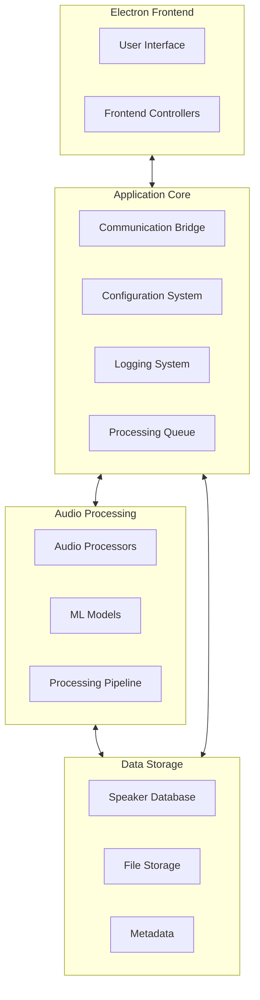

# Multi-Modal Audio/Video Processing Application
# Development Guidelines

## Overview

This document outlines the development approach for building a Multi-Modal Audio/Video Processing Application that isolates voices from audio/video files, identifies speakers, and organizes the processed content. The application will follow a hybrid modular architecture that balances immediate functionality with long-term flexibility.

## Core Architecture

## Development Priorities

1. **P1: Core Audio Processing Functionality** - Get voice isolation working reliably
2. **P1: Basic User Interface** - Allow file selection, processing, and output management
3. **P1: Simple Speaker Management** - Manual speaker tagging with basic metadata
4. **P2: Improved Audio Processing** - Enhanced isolation quality and customization
5. **P2: Advanced File Management** - Better organization and metadata handling
6. **P3: Speaker Recognition** - Automated speaker identification
7. **P3: Advanced Features** - Analytics, API access, batch processing

## Hybrid Modular Approach

The application will use a hybrid approach that focuses on immediate functionality while laying groundwork for future extensibility:

### 1. Audio Processing Engine with Strategy Pattern + Direct Implementation

**Implementation Approach:**
- Create an `AudioProcessor` interface with core methods
- Implement a concrete `DemucsProcessor` class for immediate functionality
- Use a simple factory method for processor creation
- Focus on making the Demucs implementation robust before adding alternatives

**Pros:**
- Gets you started quickly with proven technology
- Easy to understand and debug initially
- Foundation for adding new processing methods later
- Reliable performance by focusing optimization efforts

**Cons:**
- Limited initial options
- Some redesign needed for new methods later
- Possible growing pains during expansion

**⚠️ Architecture Commitment:**
- Choice of PyTorch and Demucs integration approach will be difficult to change later
- Audio preprocessing pipeline design decisions will affect all future processing methods

### 2. ML Model Registry with Simple Version Control

**Implementation Approach:**
- Create a straightforward `ModelRegistry` class for model management
- Use a simple directory structure for version control: `/models/{model_name}/{version}/`
- Implement direct PyTorch integration initially
- Include standardized metadata in JSON format

**Pros:**
- Organized from the start with clear version history
- Easy model updates without breaking existing processes
- Simple rollback to previous versions if needed
- Clear history of model evolution

**Cons:**
- Limited to PyTorch initially
- Basic tracking without advanced features
- Manual management required

**⚠️ Architecture Commitment:**
- Model storage format decisions will affect future model compatibility
- Version naming and metadata conventions will be established early

### 3. Storage Layer with Repository Pattern + Direct SQLite

**Implementation Approach:**
- Define repositories for key entities (AudioFiles, Speakers, ProcessingHistory)
- Implement with direct SQLite initially without ORM abstraction
- Package database access in repository classes
- Include simple migration system for schema changes

**Pros:**
- Simple but structured data access
- Consistent interface for all data operations
- Easy to start using with SQLite
- Clear path to more advanced databases later

**Cons:**
- Limited initial database capabilities
- Direct SQL code requires more maintenance
- Performance limitations with large datasets

**⚠️ Architecture Commitment:**
- Database schema design will be challenging to change extensively once in use
- Repository API design will establish patterns for all future data access

### 4. Basic Speaker Tagging with Future Recognition Hooks

**Implementation Approach:**
- Create simple speaker database with basic information fields
- Implement manual tagging interface for processed audio
- Extract metadata from filenames and descriptions where possible
- Design database schema with placeholders for future recognition data

**Pros:**
- Focus on core functionality first
- Simple manual tagging with familiar interface
- Leverages user knowledge for accurate identification
- Foundation for future recognition features

**Cons:**
- Limited automation initially
- Basic metadata support
- Recognition features deferred to later phases

**⚠️ Architecture Commitment:**
- Speaker profile data model will need to accommodate future recognition features
- Identification workflow decisions will establish user expectations

### 5. Processing Pipeline with Config-Driven Approach + Fixed Initial Steps

**Implementation Approach:**
- Create pipeline executor that reads step configurations from JSON
- Start with fixed set of predefined steps
- Implement each step as a separate module
- Include validation for pipeline configuration

**Pros:**
- Clearly defined processing steps
- Easy to adjust parameters without code changes
- Reproducible results across processing runs
- Foundation for more advanced pipelines later

**Cons:**
- Limited initial step options
- Fixed sequence initially
- Configuration can become complex

**⚠️ Architecture Commitment:**
- Pipeline step interface design will affect all future processing components
- Data format between pipeline steps will establish internal API conventions

## Speaker Database Details

### Database Structure

**Core Tables:**
- `speakers` - Speaker identity information
- `audio_files` - Original source files
- `processed_files` - Isolated voice tracks
- `speaker_appearances` - Links speakers to processed files
- `tags` - Categorization system for speakers and files

**Speaker Information:**
- Unique ID
- Display name
- Optional biography/notes
- Creation/modification dates
- Tags for categorization
- Placeholder fields for future recognition data

### Workflow Integration

1. **File Processing Flow:**
   - User imports audio/video file
   - System processes the file with Demucs to isolate voices
   - For each voice track, user selects speaker from database or creates new entry
   - System saves isolated tracks with speaker information
   - Database updated with relationships between original file, isolated tracks, and speakers

2. **File Organization:**
   - Configurable file naming patterns using speaker and source information
   - Optional folder organization by speaker, date, or source
   - Database maintains relationships regardless of file location

3. **Search and Retrieval:**
   - Find all content by specific speaker
   - Filter by date, source, tags
   - Combined searches across multiple criteria

### Future Expansion Path

**Phase 1 (Initial):**
- Basic speaker profiles with manual assignment
- Simple metadata extraction from filenames
- Direct file system organization

**Phase 2 (Enhanced):**
- Extended speaker profiles
- Voice characteristics tracking
- Batch processing operations
- Basic analytics on speaker appearances

**Phase 3 (Advanced):**
- Voice print matching
- Face recognition integration
- Confidence scoring for identifications
- User feedback loop for recognition improvement

## Implementation Approach

### Critical Path Implementation Sequence

1. **Core Infrastructure** (P1)
   - Electron application shell
   - Python backend with IPC bridge
   - Basic configuration and logging
   - Simple file browser and selection UI

2. **Audio Processing Engine** (P1)
   - Demucs integration with PyTorch
   - File loading and format conversion
   - Basic voice isolation pipeline
   - Processing progress indicators

3. **Storage System** (P1)
   - SQLite database setup
   - Speaker database tables
   - File storage organization
   - Basic query capabilities

4. **Voice Isolation MVP** (P1)
   - End-to-end processing workflow
   - Manual speaker tagging
   - File output with speaker information
   - Basic waveform visualization

5. **Enhanced Processing** (P2)
   - Improved separation quality
   - Processing parameters adjustment
   - Noise reduction options
   - Batch processing capabilities

6. **Advanced Management** (P2)
   - Enhanced search and filtering
   - Improved metadata handling
   - Processing history tracking
   - Export and backup options

7. **Speaker Recognition** (P3)
   - Voice print extraction
   - Basic recognition algorithms
   - Face detection from video
   - Recognition confidence scoring

8. **Extended Features** (P3)
   - API for integration with other tools
   - Advanced analytics dashboard
   - Plugin system for extensibility
   - Cloud processing options

### Testing and Validation

Each implementation milestone should include:

- Unit tests for core components
- Integration tests for end-to-end workflows
- Performance benchmarks with various file types
- User interface usability verification

## Technology Stack

### Core Technologies

- **Frontend:** Electron with React and TypeScript
- **Backend:** Python with FastAPI
- **Audio Processing:** 
  - Demucs for source separation
  - librosa for audio analysis
  - PyTorch + ONNX Runtime for ML models
- **Speaker Identification:**
  - Silero VAD for voice activity detection
  - Pyannote for speaker diarization
  - Whisper for speech recognition
- **Database:** SQLite with direct queries
- **UI Components:** React with Wavesurfer.js for audio visualization

### Technology Selection Principles

1. **Prefer established libraries** with active maintenance
2. **Favor Python ecosystem** for audio and ML processing
3. **Use TypeScript** for frontend type safety
4. **Balance performance and ease of development**
5. **Consider GPU acceleration** where significant benefits exist

## Checkpoint Validation Criteria

### Core Infrastructure Validation
- Application launches successfully on target platform
- Python backend starts and communicates with Electron frontend
- Configuration changes are properly applied
- Error handling captures and reports issues appropriately

### Audio Processing Validation
- Successfully processes various audio formats (MP3, WAV, FLAC)
- Handles files of different durations (short clips to hour+ recordings)
- Correctly separates voices from background in various scenarios
- GPU acceleration functions properly when available
- Memory management handles large files appropriately

### Speaker Management Validation
- Speaker profiles can be created, updated, and deleted
- Speakers can be assigned to processed audio tracks
- Files are named and organized according to configuration
- Speaker information can be searched and filtered effectively

### Overall System Validation
- Complete processing workflow functions end-to-end
- Performance meets expectations on target hardware
- User interface is responsive and intuitive
- Data integrity is maintained throughout operations
- System recovers gracefully from errors

## Development Process

1. **Iterative Development Cycles**
   - Focus on one component at a time
   - Build vertical slices of functionality
   - Regular integration of components
   - Frequent testing with real audio data

2. **Progressive Enhancement**
   - Start with core functionality
   - Add features incrementally
   - Refine existing features based on testing
   - Balance new features with technical debt management

3. **Technical Debt Management**
   - Regular refactoring cycles
   - Clear documentation of design decisions
   - Unit test coverage for critical components
   - Periodic architecture reviews