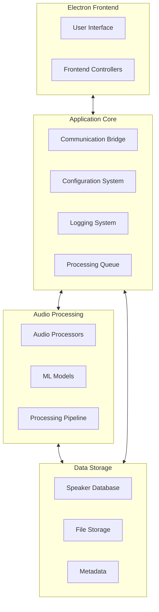
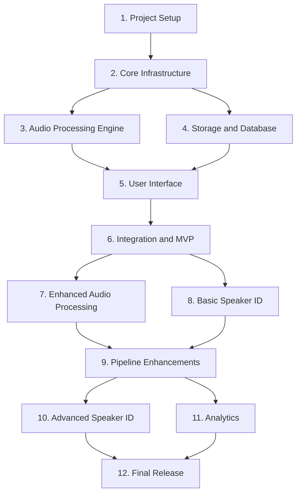
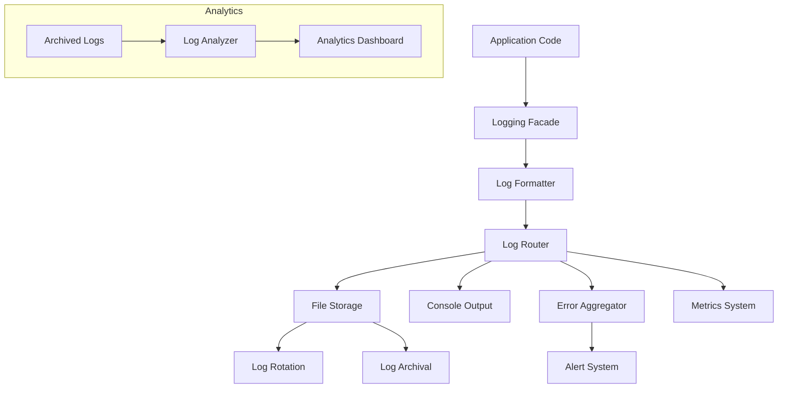
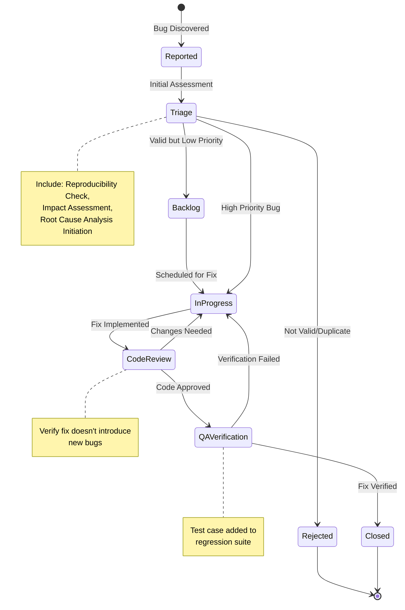

# Multi-Modal Audio/Video Processing Application
# Project Handbook

## Table of Contents

1. [Project Vision and Objectives](#project-vision-and-objectives)
2. [Project Scope](#project-scope)
3. [Methodological Approach](#methodological-approach)
4. [Architecture and Technical Design](#architecture-and-technical-design)
5. [Implementation Plan](#implementation-plan)
6. [Resource Requirements](#resource-requirements)
7. [Risk Assessment and Mitigation](#risk-assessment-and-mitigation)
8. [Validation and Testing Strategy](#validation-and-testing-strategy)
9. [Appendices and References](#appendices-and-references)

---

## Project Vision and Objectives

### Vision Statement

To create a powerful and intuitive application that processes audio and video files to isolate individual voices, identify speakers, and organize the processed content in a structured and searchable manner.

### Core Objectives

1. **Voice Isolation**: Extract clear voice tracks from mixed audio sources, even in challenging acoustic environments
2. **Speaker Identification**: Enable users to identify and track speakers across multiple recordings
3. **Content Organization**: Provide comprehensive tools for organizing and retrieving processed audio by speaker, date, or content
4. **Scalable Processing**: Support batch processing and efficient handling of large files
5. **Extensible Architecture**: Create a foundation that allows for future enhancements and integrations

### Success Criteria

- Successful voice isolation in 90%+ of common recording scenarios
- Intuitive interface requiring minimal training for basic operations
- Processing speed of at least 5x real-time on recommended hardware
- Reliable file management with zero data loss during normal operations
- Extensible architecture proven through at least two major feature additions

---

## Project Scope

### Core Functionality

#### Input Processing
- Accept audio files (.mp3, .wav, .aac, etc.) and video files (.mp4, .mov, .avi)
- Validate file integrity and format compatibility
- Extract audio stream from video files when necessary
- Support batch processing of multiple files
- Classify acoustic environment to optimize processing

#### Voice Isolation
- Implement source separation using deep learning models (Demucs, Spleeter)
- Filter background noise and music
- Maintain audio quality during separation
- Handle overlapping speakers and poor audio quality
- Generate individual audio files for each detected speaker
- Provide customizable processing parameters

#### Speaker Identification
- Create unique voice prints for recognition
- Support manual speaker labeling
- Extract and utilize audio metadata
- Support multi-language and dialect processing
- Implement facial recognition for video files (future phase)
- Provide confidence thresholds and manual override options

#### File Management
- Create standardized naming convention for processed files
- Store comprehensive metadata with processed audio
- Implement searchable indexes and cross-referencing
- Support version control of processed files
- Provide backup functionality
- Offer cloud storage options (future phase)

#### User Interface
- Provide intuitive UI with processing status indicators
- Implement progress indicators for long-running tasks
- Offer visual feedback on audio separation quality
- Include waveform visualization for audio editing
- Support dark/light mode options

### Out of Scope (Initial Release)

- Real-time audio processing
- Custom training of ML models
- Speaker emotion detection
- Full transcription services
- Mobile applications
- Multi-user collaboration features

These features may be considered for future releases but are not part of the initial product scope.

---

## Methodological Approach

### Hybrid Modular Architecture

The application will follow a hybrid modular approach that balances immediate functionality with long-term flexibility. This approach allows for rapid delivery of core features while establishing a foundation for future expansion.

#### Key Principles

1. **Focused Initial Implementation**: Prioritize core functionality with direct implementations
2. **Strategic Abstraction**: Create interfaces and abstractions only where future change is likely
3. **Progressive Enhancement**: Build basic functionality first, then enhance iteratively
4. **Clear Component Boundaries**: Establish well-defined interfaces between major components
5. **Technology Isolation**: Contain technology-specific code to limit the impact of future changes

#### Development Methodology

1. **Iterative Development**:
   - Deliver functionality in vertical slices across the stack
   - Build minimum viable implementations first, then enhance
   - Regular integration of components to ensure cohesion
   - Frequent testing with real audio/video data

2. **Progressive Modularization**:
   - Start with direct implementations for rapid progress
   - Identify abstraction points after concrete implementations prove successful
   - Apply "Rule of Three" - abstract only after three similar implementations
   - Balance between immediate delivery and future flexibility

3. **Technical Debt Management**:
   - Regular refactoring cycles built into the development process
   - Clear documentation of design decisions and technical debt
   - Unit test coverage for critical components
   - Periodic architecture reviews to ensure alignment with goals

---

## Architecture and Technical Design

### System Architecture



### Component Design

#### 1. Audio Processing Engine

**Design Approach:** Strategy Pattern + Direct Implementation

- Create an `AudioProcessor` interface with core methods
- Implement a concrete `DemucsProcessor` class for immediate functionality
- Use a simple factory method for processor creation
- Focus on making the Demucs implementation robust before adding alternatives

**Architectural Commitments:**
- Choice of PyTorch and Demucs integration approach will be difficult to change later
- Audio preprocessing pipeline design decisions will affect all future processing methods

#### 2. ML Model Registry

**Design Approach:** Simple Version Control

- Create a straightforward `ModelRegistry` class for model management
- Use a simple directory structure for version control: `/models/{model_name}/{version}/`
- Implement direct PyTorch integration initially
- Include standardized metadata in JSON format

**Architectural Commitments:**
- Model storage format decisions will affect future model compatibility
- Version naming and metadata conventions will be established early

#### 3. Storage Layer

**Design Approach:** Repository Pattern + Direct SQLite

- Define repositories for key entities (AudioFiles, Speakers, ProcessingHistory)
- Implement with direct SQLite initially without ORM abstraction
- Package database access in repository classes
- Include simple migration system for schema changes

**Architectural Commitments:**
- Database schema design will be challenging to change extensively once in use
- Repository API design will establish patterns for all future data access

#### 4. Speaker Management

**Design Approach:** Basic Speaker Tagging with Future Recognition Hooks

- Create simple speaker database with basic information fields
- Implement manual tagging interface for processed audio
- Extract metadata from filenames and descriptions where possible
- Design database schema with placeholders for future recognition data

**Architectural Commitments:**
- Speaker profile data model will need to accommodate future recognition features
- Identification workflow decisions will establish user expectations

#### 5. Processing Pipeline

**Design Approach:** Config-Driven Approach + Fixed Initial Steps

- Create pipeline executor that reads step configurations from JSON
- Start with fixed set of predefined steps
- Implement each step as a separate module
- Include validation for pipeline configuration

**Architectural Commitments:**
- Pipeline step interface design will affect all future processing components
- Data format between pipeline steps will establish internal API conventions

### Database Design

#### Core Tables

- `speakers` - Speaker identity information
- `audio_files` - Original source files
- `processed_files` - Isolated voice tracks
- `speaker_appearances` - Links speakers to processed files
- `tags` - Categorization system for speakers and files

#### Speaker Schema

```
speakers
  - id: UUID (PK)
  - name: TEXT
  - description: TEXT
  - created_at: DATETIME
  - updated_at: DATETIME
  - metadata: JSON
  - voice_print_data: BLOB (NULL initially)
  - face_data: BLOB (NULL initially)
```

#### Relationships

```
audio_files
  - id: UUID (PK)
  - filename: TEXT
  - path: TEXT
  - duration: REAL
  - format: TEXT
  - channels: INTEGER
  - sample_rate: INTEGER
  - created_at: DATETIME
  - metadata: JSON

processed_files
  - id: UUID (PK)
  - original_file_id: UUID (FK to audio_files)
  - speaker_id: UUID (FK to speakers, NULL if unknown)
  - path: TEXT
  - processing_config: JSON
  - quality_score: REAL
  - created_at: DATETIME
  
speaker_appearances
  - id: UUID (PK)
  - processed_file_id: UUID (FK to processed_files)
  - speaker_id: UUID (FK to speakers)
  - confidence: REAL
  - start_time: REAL
  - end_time: REAL
  - metadata: JSON
```

### Technology Stack

#### Core Technologies

- **Frontend:** Electron with React and TypeScript
- **Backend:** Python with FastAPI
- **Audio Processing:** 
  - Demucs for source separation
  - librosa for audio analysis
  - PyTorch + ONNX Runtime for ML models
- **Speaker Identification:**
  - Silero VAD for voice activity detection
  - Pyannote for speaker diarization
  - Whisper for speech recognition (future phase)
- **Database:** SQLite with direct queries
- **UI Components:** React with Wavesurfer.js for audio visualization

#### Technology Selection Principles

1. **Prefer established libraries** with active maintenance
2. **Favor Python ecosystem** for audio and ML processing
3. **Use TypeScript** for frontend type safety
4. **Balance performance and ease of development**
5. **Consider GPU acceleration** where significant benefits exist

---

## Implementation Plan

### Phased Approach

The implementation will follow a prioritized approach with three main phases, with clear dependencies between components.

#### Phase 1 (P1): Core Functionality

Deliver the essential capabilities needed for voice isolation and basic speaker management:

1. **Project Setup and Environment Configuration**
2. **Core Infrastructure Implementation**
3. **Audio Processing Engine Implementation**
4. **Storage and Database Implementation**
5. **User Interface Implementation**
6. **Integration and MVP Completion**

#### Phase 2 (P2): Enhanced Capabilities

Improve the quality and usability of the application:

1. **Enhanced Voice Isolation Capabilities**
2. **Basic Speaker Identification**
3. **Pipeline and Workflow Enhancements**

#### Phase 3 (P3): Advanced Features

Add sophisticated capabilities for serious users:

1. **Advanced Speaker Identification**
2. **Analytics and Reporting**
3. **API and Integration Capabilities**

### Critical Path and Dependencies

The implementation will follow this critical path with clear dependencies:



### Implementation Checklist

Below is a high-level implementation checklist organized by phase. For a more detailed task-by-task breakdown with complete dependencies, refer to the separate [Implementation Checklist](checklist.md) document.

#### Phase 1 (P1): Core Functionality Checklist

**Project Setup and Environment Configuration**
- [ ] Create project repository with README, LICENSE, and .gitignore
- [ ] Set up development environment (Node.js, Python, CUDA)
- [ ] Configure dependency management (package.json, pyproject.toml)
- [ ] Set up build system (TypeScript, Webpack, Electron Forge)

**Core Infrastructure Implementation**
- [ ] Design and implement IPC protocol between Electron and Python
- [ ] Create configuration system with validation
- [ ] Implement structured logging framework
- [ ] Develop basic user interface shell

**Audio Processing Engine Implementation**
- [ ] Implement audio file loading and format detection
- [ ] Integrate Demucs library with appropriate interface
- [ ] Create audio processing pipeline architecture
- [ ] Implement GPU acceleration with fallback

**Storage and Database Implementation**
- [ ] Design and implement SQLite database schema
- [ ] Create repository interfaces for core entities
- [ ] Implement speaker database with basic fields
- [ ] Develop file storage organization system

**User Interface Implementation**
- [ ] Create file browser component with preview capability
- [ ] Implement processing controls and parameter adjustment
- [ ] Integrate waveform visualization with Wavesurfer.js
- [ ] Develop speaker management interface

**Integration and MVP Completion**
- [ ] Connect all components in end-to-end workflow
- [ ] Optimize performance for common operations
- [ ] Refine user experience with keyboard shortcuts
- [ ] Create installer and distribution package

#### Phase 2 (P2): Enhanced Capabilities Checklist

**Enhanced Voice Isolation**
- [ ] Implement acoustic environment classification
- [ ] Add support for multiple Demucs model variants
- [ ] Develop advanced noise reduction algorithms
- [ ] Create parameter optimization system

**Basic Speaker Identification**
- [ ] Integrate Silero VAD for voice activity detection
- [ ] Enhance speaker database management
- [ ] Implement metadata extraction for speaker suggestions
- [ ] Add extended profile information for speakers

**Pipeline and Workflow Enhancements**
- [ ] Implement config-driven pipeline with JSON/YAML
- [ ] Develop comprehensive batch processing system
- [ ] Add dark/light theme support and UI customization
- [ ] Create export options with metadata inclusion

#### Phase 3 (P3): Advanced Features Checklist

**Advanced Speaker Identification**
- [ ] Integrate Pyannote Audio for speaker diarization
- [ ] Implement voice print extraction and comparison
- [ ] Add facial recognition for video content
- [ ] Integrate Whisper for speech recognition

**Analytics and Reporting**
- [ ] Create processing quality metrics dashboard
- [ ] Implement usage statistics tracking
- [ ] Develop comparative analysis tools
- [ ] Add performance monitoring

**API and Integration**
- [ ] Design and implement REST API
- [ ] Create documentation and SDK
- [ ] Implement security measures
- [ ] Add cloud storage integration options

For detailed task breakdowns, dependencies, effort estimations, and validation criteria for each item, please refer to the complete [Implementation Checklist](checklist.md).

---

## Resource Requirements

### Development Resources

#### Hardware Requirements

**Development Environment:**
- **CPU:** 6+ core modern processor (Intel i7/i9 or AMD Ryzen 7/9)
- **RAM:** 32GB minimum
- **GPU:** NVIDIA RTX 3070 or better with 8GB+ VRAM
- **Storage:** 1TB SSD with at least 100GB free for development
- **OS:** Windows 10/11, macOS, or Linux

**Testing Environment:**
- Various hardware configurations representing target user systems
- Range of audio/video recording devices for input testing
- Range of speaker configurations for output testing

#### Software Requirements

**Development Tools:**
- Visual Studio Code or PyCharm Professional
- Git for version control
- Node.js and npm
- Python 3.9 or newer
- CUDA Toolkit and cuDNN for GPU acceleration
- Docker for containerized testing

**Dependencies:**
- Electron and React for frontend
- PyTorch for ML models
- librosa and other audio processing libraries
- Demucs or similar voice separation models
- SQLite for database (initially)

### Target User Requirements

#### Recommended System Specifications

**Minimum Requirements:**
- **CPU:** Quad-core 2.5GHz or better
- **RAM:** 8GB
- **Storage:** 10GB free space plus storage for audio files
- **OS:** Windows 10 or newer, macOS 10.15 or newer

**Recommended Requirements:**
- **CPU:** 6+ core 3GHz+
- **RAM:** 16GB+
- **GPU:** NVIDIA GPU with CUDA support, 4GB+ VRAM
- **Storage:** 50GB+ SSD
- **OS:** Windows 10 or newer, macOS 10.15 or newer

### Team Requirements

**Core Development Team:**
- Frontend Developer (Electron, React, TypeScript)
- Backend Developer (Python, Audio Processing)
- ML Engineer (PyTorch, Audio Models)
- UI/UX Designer
- QA Engineer

**Extended Support:**
- Technical Writer for documentation
- DevOps for CI/CD and deployment
- Product Manager for feature prioritization

---

## Risk Assessment and Mitigation

### Technical Risks

| Risk | Impact | Probability | Mitigation Strategy |
|------|--------|------------|---------------------|
| Audio isolation quality fails to meet expectations | High | Medium | Multiple algorithm options, extensive testing with diverse audio samples, parameter tuning capabilities |
| Performance issues with large audio files | High | Medium | Chunked processing, memory optimization, progress indicators, GPU acceleration |
| ML model compatibility issues across platforms | Medium | High | Version pinning, compatibility testing, fallback mechanisms |
| Database scalability with large collections | Medium | Low | Indexing optimization, query profiling, upgrade path to more robust database |
| GPU acceleration unavailability on user systems | Medium | Medium | CPU fallback with clear performance expectations, documentation on hardware requirements |

### Business Risks

| Risk | Impact | Probability | Mitigation Strategy |
|------|--------|------------|---------------------|
| Competing solutions emerge with better features | High | Medium | Prioritize unique value proposition, maintain extensibility for rapid feature additions |
| User expectations exceed MVP capabilities | Medium | High | Clear communication about roadmap, early access program, feedback channels |
| Hardware requirements too demanding for target users | High | Low | Configurable quality settings, benchmark suite, minimum hardware recommendations |
| Privacy concerns with speaker identification | Medium | Medium | Clear data handling documentation, local-only processing options, compliance with privacy regulations |
| Dependency on third-party ML models | Medium | Medium | Evaluation of license terms, alternative model options, abstraction layer for model swapping |

### Contingency Plans

#### Audio Processing Quality Issues
- Maintain alternative algorithm implementations
- Implement user-adjustable processing parameters
- Develop specialized processing paths for challenging audio types
- Create objective quality metrics for continuous improvement

#### Performance Bottlenecks
- Implement profiling throughout development process
- Establish performance benchmarks for key operations
- Create scalability test suite with diverse audio samples
- Design architecture to allow component-level optimization

#### Technical Debt Accumulation
- Schedule regular refactoring cycles
- Maintain comprehensive test coverage
- Document architectural decisions and technical debt
- Conduct periodic architecture reviews

---

## Validation and Testing Strategy

### Testing Methodology

#### Unit Testing
- Test individual components in isolation
- Focus on core algorithms and critical paths
- Automated tests with CI integration
- Target 80%+ code coverage for critical components

#### Integration Testing
- Test interactions between components
- Focus on data flow and state management
- Automated where possible, manual for complex scenarios
- Include error conditions and recovery paths

#### Performance Testing
- Benchmark processing speed on various hardware configurations
- Test memory usage patterns with different file sizes
- Evaluate GPU acceleration benefits
- Stress test with batch processing

#### User Experience Testing
- Conduct usability testing with representative users
- Gather feedback on workflow efficiency
- Evaluate learnability for new users
- Test accessibility compliance

### Validation Checkpoints

#### Core Infrastructure Validation
- Application launches successfully on target platforms
- Python backend starts and communicates with Electron frontend
- Configuration changes are properly applied
- Error handling captures and reports issues appropriately

#### Audio Processing Validation
- Successfully processes various audio formats (MP3, WAV, FLAC)
- Handles files of different durations (short clips to hour+ recordings)
- Correctly separates voices from background in various scenarios
- GPU acceleration functions properly when available
- Memory management handles large files appropriately

#### Speaker Management Validation
- Speaker profiles can be created, updated, and deleted
- Speakers can be assigned to processed audio tracks
- Files are named and organized according to configuration
- Speaker information can be searched and filtered effectively

#### Overall System Validation
- Complete processing workflow functions end-to-end
- Performance meets expectations on target hardware
- User interface is responsive and intuitive
- Data integrity is maintained throughout operations
- System recovers gracefully from errors

### Quality Targets

- **Voice Separation Quality:** Clear voice isolation in 90%+ of test cases
- **Processing Speed:** At least 5x faster than real-time on recommended hardware
- **Memory Efficiency:** Process 60-minute audio files on systems with 8GB RAM
- **User Experience:** Complete common tasks in 25% fewer steps than competing solutions
- **Stability:** Zero crashes during normal operation, graceful handling of resource limitations

## Implementation Verification and Quality Assurance

### Implementation Verification Strategy

#### Continuous Verification Process
- Implement feature verification checklist for each component
- Require passing automated tests before merge
- Conduct regular code reviews with verification focus
- Use feature toggles to isolate new functionality for testing
- Have explicit acceptance criteria for each implementation task

#### Quality Gates
- Define clear exit criteria for each development phase
- Require specific test coverage thresholds
- Implement static code analysis with enforced quality rules
- Perform security scanning before key milestones
- Conduct structured review sessions for critical components

#### Verification Documentation
- Document test scenarios and expected outcomes
- Create regression test suite for core functionality
- Maintain verification history for critical components
- Document edge cases and their handling
- Record verification decisions and rationales

### Advanced Logging Framework

#### Logging Architecture


#### Logging Standards
- **Log Levels and Usage Guidance:**
  - `TRACE`: Fine-grained debugging details (disabled in production)
  - `DEBUG`: Debugging information for developers (disabled in production)
  - `INFO`: General operational information
  - `WARN`: Potential issues that don't affect core functionality
  - `ERROR`: Problems that affect functionality but don't crash the system
  - `FATAL`: Critical issues that cause system failure

- **Structured Logging Format:**
  - JSON format with standardized fields
  - Include timestamp, log level, component name, thread ID
  - Include correlation ID for tracking request flows
  - Add context-specific data in structured fields
  - Support custom attributes for specialized tracking

- **Context Enrichment:**
  - User context (user ID, session ID)
  - Request context (HTTP method, path, response code)
  - Performance metrics (execution time, resource usage)
  - Environment information (version, deployment ID)

#### Log Storage and Management
- **Storage Strategy:**
  - Short-term logs: High detail, rapid access
  - Medium-term logs: Aggregated, searchable
  - Long-term logs: Compliance, security events only
  
- **Rotation and Archival:**
  - Size-based rotation (max 100MB per file)
  - Event-based rotation (per processing session)
  - Compression after file rotation
  - Automatic archival to cold storage after defined retention milestones
  
- **Log Security:**
  - Encryption for sensitive logs
  - Access control for log viewing
  - Audit trail for log access
  - PII scrubbing for compliance

#### Log Analysis and Utilization
- **Real-time Monitoring:**
  - Critical error alerting with notification channels
  - Anomaly detection for unusual patterns
  - Dashboard for system health status
  
- **Analysis Tools:**
  - Integrated log search and filtering capabilities
  - Pattern recognition for common issues
  - Correlation analysis across components
  - Visualization of log trends over time
  
- **Integration Points:**
  - Bug tracking system integration
  - Performance monitoring correlation
  - Security incident tracking
  - Compliance reporting

### Comprehensive Bug Management System

#### Bug Classification Framework
- **Severity Levels:**
  - **S1 (Critical)**: System crash, data loss, security breach
  - **S2 (High)**: Major functionality broken, no workaround
  - **S3 (Medium)**: Feature partially broken, workaround exists
  - **S4 (Low)**: Minor issue, cosmetic, enhancement
  
- **Bug Categories:**
  - **Functional**: Incorrect behavior, missing features
  - **Performance**: Speed, resource usage, scalability
  - **UI/UX**: Interface issues, usability problems
  - **Security**: Vulnerabilities, authentication issues
  - **Data**: Corruption, inconsistency, validation errors
  - **Compatibility**: Platform/environment issues
  - **Integration**: Issues between components

- **Origin Tracking:**
  - Component/module identification
  - Code layer (UI, business logic, data)
  - Introduction point (which change/feature)
  - Environmental factors (OS, hardware, configuration)

#### Bug Lifecycle Management



#### Bug Tracking Infrastructure
- **Central Bug Repository:**
  - Single source of truth for all bugs
  - Searchable and filterable database
  - Historical tracking and trend analysis
  - Integration with version control system
  
- **Bug Report Requirements:**
  - Detailed reproduction steps
  - Expected vs. actual results
  - Environment information
  - Severity and impact assessment
  - Related logs and screenshots
  - Version and build information
  
- **Knowledge Base Integration:**
  - Link bugs to specific documentation updates
  - Create known issue database with workarounds
  - Develop troubleshooting guides from common issues
  - Maintain solution patterns for recurring problems

#### Proactive Bug Prevention
- Implement static code analysis in IDE and CI pipeline
- Use linting tools with strict rules for common issues
- Conduct regular code reviews focused on quality
- Employ pair programming for complex features
- Follow consistent coding standards with automated enforcement

#### Root Cause Analysis Process
- **Formal RCA Methodology:**
  1. Define the problem scope and impact
  2. Collect data (logs, reports, code changes)
  3. Identify contributing factors
  4. Determine primary and secondary causes
  5. Develop preventive measures
  6. Document findings and lessons learned
  
- **RCA Documentation Template:**
  - Bug summary and timeline
  - Technical background and context
  - Investigation process and findings
  - Root cause identification
  - Short-term fix implementation
  - Long-term prevention measures
  - Related systems potentially affected
  
- **Knowledge Sharing Protocol:**
  - Team review sessions for significant bugs
  - Pattern identification across related issues
  - Update to coding standards and best practices
  - Training materials derived from lessons learned

#### Systematic Bug Fix Approach
- **Fix Prioritization Framework:**
  - Impact on user experience
  - Number of affected users
  - Risk of regression or data loss
  - Business impact (revenue, reputation)
  - Complexity and effort estimation
  
- **Bug Fix Workflow:**
  1. Reproduce and verify the issue
  2. Create isolated test case that fails
  3. Implement minimal fix to make test pass
  4. Add regression test to prevent recurrence
  5. Review for similar issues elsewhere in code
  6. Document fix approach and rationale
  
- **Bug Fix Documentation:**
  - Root cause explanation
  - Fix approach and alternatives considered
  - Testing methodology
  - Potential side effects
  - Related code areas for review
  - Before/after behavior description

#### Bug Analytics and Improvement Loop
- **Metrics Dashboard:**
  - Bug detection rate by phase
  - Average time to resolution
  - Bug density by component
  - Regression and recurrence rates
  - Fix effectiveness measurement
  
- **Trend Analysis:**
  - Identify most bug-prone components
  - Track bug introduction during feature development
  - Measure testing effectiveness
  - Correlate bugs with development practices
  
- **Continuous Improvement:**
  - Regular bug trend reviews based on milestone completions
  - Component-specific improvement plans
  - Developer education based on common issues
  - Testing strategy refinement
  - Architectural improvements for problematic areas

### Integration Between Logging and Bug Management

#### Log-to-Bug Workflow
- **Automated Issue Creation:**
  - Generate bug reports from critical error logs
  - Aggregate similar errors into single issues
  - Include contextual information and stack traces
  - Link directly to relevant log sections

- **Troubleshooting Tools:**
  - Single-click navigation from bug to related logs
  - Timeline view of events leading to bug
  - Visual correlation between system metrics and errors
  - Environment comparison between working/failing states

#### Bug Knowledge Repository
- **Searchable Solution Database:**
  - Index bugs and solutions by error patterns
  - Link error signatures to specific fixes
  - Provide code examples of correct implementations
  - Include performance impact of different approaches

- **Learning System:**
  - Tag bugs with root cause categories
  - Generate developer guidance from recurring issues
  - Create educational content from significant bugs
  - Build decision trees for common problem types

#### Bug and Logging Review Process
- **Prioritized Bug Review:**
  - Review new critical and high-priority bugs
  - Analyze trends and patterns
  - Assign investigation tasks for complex issues
  - Validate fix approaches for challenging bugs

- **Continuous Quality Improvement:**
  - Review bug metrics and trends at milestones
  - Identify top areas for focused improvement
  - Update coding standards based on lessons learned
  - Plan targeted refactoring for problematic areas

### Additional Quality Targets

- **Bug Fix Prioritization:**
  - Critical bugs (S1): Addressed with highest priority, blocking all other work
  - High priority bugs (S2): Addressed promptly after critical issues
  - Medium priority bugs (S3): Scheduled in next development batch
  - Low priority bugs (S4): Addressed when resources permit or grouped with related features

- **Bug Detection Efficiency:**
  - 90% of bugs detected before reaching production
  - 50% of bugs found through automated testing
  - Less than 5% of fixes create new bugs

- **Log Effectiveness:**
  - 95% of critical errors provide sufficient context for diagnosis
  - Log search and retrieval completed in under 30 seconds
  - Error-to-solution time reduced by 30% with logging guidance

---

## Appendices and References

### Appendix A: Detailed Technical Documentation

#### A.1 ML Model Documentation
- Demucs model architecture and capabilities
- PyTorch version compatibility requirements
- Model parameter optimization guidelines
- GPU acceleration configuration

#### A.2 Database Schema
- Complete entity-relationship diagrams
- Schema migration strategy
- Indexing and optimization guidelines
- Backup and recovery procedures

#### A.3 API Documentation
- Internal API between Python and Electron
- Future external API specifications
- Authentication and security considerations
- Rate limiting and resource management

### Appendix B: User Experience Guidelines

#### B.1 UI Style Guide
- Color palette and theming principles
- Typography specifications
- Component design patterns
- Responsive design guidelines

#### B.2 Workflow Documentation
- Common user journeys
- Keyboard shortcuts
- Progressive disclosure of advanced features
- Error handling and user feedback

### Appendix C: Project References

#### C.1 Similar Applications
- Analysis of competing solutions
- Feature comparison matrix
- Unique selling propositions

#### C.2 Research Papers
- Source separation methodology
- Speaker identification techniques
- Audio quality enhancement algorithms

#### C.3 Technical Resources
- Key libraries and frameworks
- Learning resources for team members
- Community and support channels

---

This handbook serves as the authoritative reference for the Multi-Modal Audio/Video Processing Application project. It provides comprehensive guidance for all phases of development and should be consulted whenever questions arise about project scope, implementation approach, or technical decisions.

The handbook is a living document that will be updated as the project evolves. Major revisions will be tracked with version numbers and change logs.