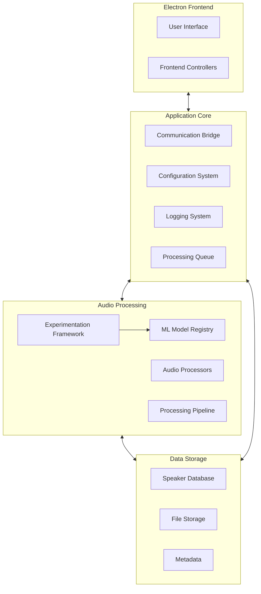
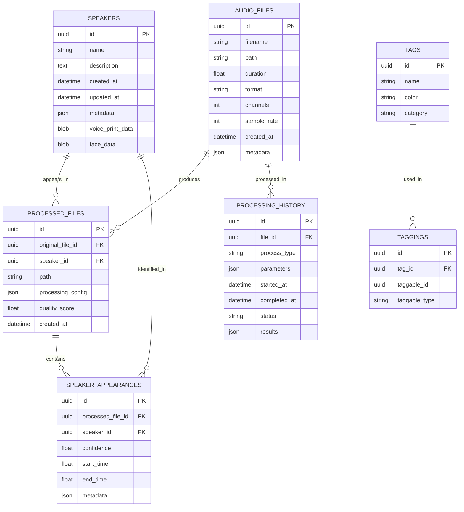

# Multi-Modal Audio/Video Processing Application
# Comprehensive Implementation Guide

## Table of Contents

1. [Project Overview](#project-overview)
2. [Core Architecture](#core-architecture)
3. [Technical Foundation](#technical-foundation)
   - [Audio Processing Technologies](#audio-processing-technologies)
   - [Voice Separation Model Evaluation](#voice-separation-model-evaluation)
   - [Technical Stack Components](#technical-stack-components)
4. [Risk Management Framework](#risk-management-framework)
5. [Development Methodology](#development-methodology)
6. [Workstream Implementation Guide](#workstream-implementation-guide)
   - [Core Infrastructure Workstream](#core-infrastructure-workstream)
   - [Audio Processing Workstream](#audio-processing-workstream)
   - [Storage Workstream](#storage-workstream)
   - [User Experience Workstream](#user-experience-workstream)
7. [Component Specifications](#component-specifications)
   - [Frontend Component Design](#frontend-component-design)
   - [Audio Processing Engine Design](#audio-processing-engine-design)
   - [Machine Learning Model Registry](#machine-learning-model-registry)
   - [Database and Storage System Design](#database-and-storage-system-design)
   - [Experimentation Framework](#experimentation-framework)
8. [Implementation Checklist](#implementation-checklist)
9. [Quality Assurance Framework](#quality-assurance-framework)
10. [Technical Documentation Guidelines](#technical-documentation-guidelines)
11. [Integration Strategy](#integration-strategy)
12. [Appendices](#appendices)

## Project Overview

### Vision and Purpose

The Multi-Modal Audio/Video Processing Application is designed to process audio and video files for the purpose of isolating individual voices, identifying speakers, and organizing the processed content in a structured and searchable manner. This comprehensive guide documents all components, requirements, and implementation steps needed to realize this vision.

### Core Objectives

1. **Voice Isolation**: Extract clear voice tracks from mixed audio sources, even in challenging acoustic environments
2. **Speaker Identification**: Enable users to identify and track speakers across multiple recordings
3. **Content Organization**: Provide comprehensive tools for organizing and retrieving processed audio by speaker, date, or content
4. **Scalable Processing**: Support batch processing and efficient handling of large files
5. **Extensible Architecture**: Create a foundation that allows for future enhancements and integrations

### Success Criteria

- Successful voice isolation in 90%+ of common recording scenarios
- Intuitive interface requiring minimal training for basic operations
- Processing speed of at least 5x real-time on recommended hardware
- Reliable file management with zero data loss during normal operations
- Extensible architecture that supports addition of new features and technologies

## Core Architecture

The application follows a hybrid modular architecture that balances immediate functionality with long-term flexibility. The architecture is divided into four major components with clear interfaces between them:



### Component Responsibilities

#### Frontend Layer
- Provides user interface for all operations
- Handles file selection and preview
- Displays audio visualization and processing controls
- Manages speaker identification interface
- Implements settings and configuration UI

#### Application Core
- Manages communication between Electron frontend and Python backend
- Handles configuration loading, validation, and persistence
- Provides structured logging system
- Implements processing queue management

#### Audio Processing Layer
- Contains ML model registry for managing voice separation models
- Includes experimentation framework for model evaluation
- Implements audio processing algorithms
- Manages processing pipeline configuration and execution

#### Data Storage Layer
- Provides database for speaker information and metadata
- Handles file storage organization
- Manages metadata extraction and indexing
- Implements search and retrieval capabilities

### Key Architecture Principles

1. **Clear Component Boundaries**: Each component has well-defined interfaces
2. **Technology Isolation**: Technology-specific code is contained to limit the impact of changes
3. **Progressive Enhancement**: Initial focus on core functionality with foundation for advanced features
4. **Modular Design**: Components can be upgraded or replaced individually
5. **Consistent Patterns**: Similar problems are solved in similar ways throughout the application

## Technical Foundation

### Audio Processing Technologies

#### Voice Separation Model Evaluation

A systematic evaluation of voice separation technologies is required to determine the optimal solution for this application. The primary candidates are:

| Technology | Strengths | Limitations | Performance (2spk/3spk/4spk/5spk) | Integration Complexity |
|------------|-----------|-------------|-----------------------------------|------------------------|
| SVoice | - Best multi-speaker performance<br>- Handles unknown speaker count<br>- Moderate parameter count | - Newer, less proven<br>- More complex architecture | 20.1/16.9/12.9/10.6 SI-SNRi | Medium |
| Demucs | - Well-established<br>- Good documentation<br>- Simpler architecture | - Lower performance with 3+ speakers<br>- Fixed speaker count models | ~15.3/12.7/8.5/6.8 SI-SNRi* | Low |
| DPRNN | - Relatively small model<br>- Good performance | - Not specialized for speech<br>- Less community support | 18.8/14.7/10.4/8.7 SI-SNRi | Medium |
| TasNet variants | - Well-researched<br>- Many implementations | - Generally lower performance | Varies by implementation | Low |

*Note: Performance metrics based on published research, actual implementations may vary

#### Technology Selection Criteria

For each technology component, evaluate based on:

1. **Performance**: Objective metrics on standard datasets
2. **Adaptability**: Flexibility for different audio scenarios
3. **Integration Ease**: Compatibility with our architecture
4. **Resource Usage**: CPU/GPU/memory requirements
5. **Community Support**: Activity, documentation, and maintenance
6. **License Compatibility**: Open source considerations

#### Implementation Strategy

The application must support multiple voice separation models through:

1. Common API for all separation technologies
2. Abstraction layer for model interchange
3. Configuration-driven model selection
4. Automated fallback mechanisms

### Technical Stack Components

#### Frontend Technologies
- **Electron**: For cross-platform desktop application
- **React**: For component-based user interface
- **TypeScript**: For type safety
- **Wavesurfer.js**: For audio visualization

#### Backend Technologies
- **Python**: For audio processing and ML capabilities
- **PyTorch**: For ML model execution
- **FastAPI**: For internal API endpoints
- **librosa**: For audio analysis

#### Audio Processing Technologies
- **SVoice/Demucs**: For voice isolation (to be determined by evaluation)
- **Silero VAD**: For voice activity detection
- **Pyannote**: For speaker diarization (advanced phase)
- **Whisper**: For speech recognition (advanced phase)

#### Storage Technologies
- **SQLite**: For embedded database
- **File System**: For organized storage of audio files
- **JSON**: For metadata and configuration storage

## Risk Management Framework

### Comprehensive Risk Identification

| Risk Category | Risk | Impact | Probability | Detailed Mitigation Strategy | Contingency Plan |
|---------------|------|--------|------------|------------------------------|------------------|
| Technical | Audio isolation quality underperforms | High | Medium | 1. Create benchmarking suite with diverse audio samples<br>2. Evaluate multiple voice separation models (SVoice, Demucs, etc.)<br>3. Implement model switching capability | Fall back to best-performing model based on experimental data, even if it means reduced feature set |
| Technical | GPU acceleration unavailable | Medium | Medium | 1. Implement CPU fallback with clear performance expectations<br>2. Optimize processing for CPU-only systems<br>3. Develop chunking mechanism for large files | Offer cloud processing option for complex separations |
| Architecture | Model integration complexity | High | High | 1. Create abstraction layer for model interchange<br>2. Develop standardized API for all ML models<br>3. Implement comprehensive test suite for model compatibility | Revert to simpler, proven models while resolving integration issues |
| User | Learning curve too steep | Medium | Medium | 1. Progressive interface disclosure<br>2. Guided workflows for common tasks<br>3. Interactive tutorials and tooltips | Develop simplified mode with reduced options but core functionality intact |
| Market | Competing solutions emerge | Medium | High | 1. Regular competitive analysis<br>2. Maintain unique feature differentiation<br>3. Fast iteration cycles | Focus on niche functionality not covered by competitors |
| Technical | Memory issues with large files | High | Medium | 1. Implement chunking mechanisms<br>2. Create memory-efficient processing pipeline<br>3. Add configurable quality/memory tradeoffs | Provide clear hardware recommendations and fallback processing modes |
| Integration | Component interface incompatibilities | Medium | Medium | 1. Define clear APIs between components<br>2. Create comprehensive integration tests<br>3. Implement versioning for internal interfaces | Develop adapter patterns to handle incompatibilities |
| Technical | Database scalability issues | Medium | Low | 1. Implement proper indexing<br>2. Use query optimization techniques<br>3. Create data archiving mechanisms | Design migration path to more robust database solution |

### Risk Assessment Process

For each identified risk:

1. Determine impact severity (High/Medium/Low)
2. Evaluate probability (High/Medium/Low)
3. Calculate risk factor (Impact × Probability)
4. Develop detailed mitigation strategy
5. Create specific contingency plan
6. Assign risk owner

### Risk Monitoring and Management

1. Maintain risk register with all identified risks
2. Review risks at key implementation milestones
3. Update mitigation strategies based on new information
4. Track effectiveness of implemented mitigations
5. Document new risks as they are identified

## Development Methodology

### Implementation Approach

The application follows an agile development methodology with feature-based workstreams rather than sequential phases. Key elements of this approach include:

1. **Feature-Based Workstreams**: Development organized around functional capabilities
2. **Modular Components**: Clear interfaces between components allowing parallel development
3. **Continuous Integration**: Regular merging of all developer working copies
4. **Iterative Enhancement**: Building basic functionality first, then enhancing
5. **Experimental Evaluation**: Testing multiple approaches for key components
6. **Regular Integration Points**: Ensuring components work together throughout development

### Implementation Principles

1. **Progressive Enhancement**: Start with core functionality, then add advanced features
2. **Lean Implementation**: Choose the simplest solution that meets requirements
3. **Standardized Patterns**: Use consistent approaches for similar problems
4. **Separation of Concerns**: Each component has a clear, single responsibility
5. **Automated Testing**: Comprehensive test coverage for critical components
6. **Technical Debt Management**: Regular refactoring cycles built into development
7. **Documentation First**: Create specifications before implementation

### User-Centered Design Process

1. **Persona Development**: Create detailed user profiles with specific needs
2. **Use Case Mapping**: Document primary user workflows and requirements
3. **Interface Prototyping**: Develop UI mockups before implementation
4. **Usability Testing**: Test interfaces with representative users
5. **Iterative Refinement**: Improve designs based on user feedback
6. **Accessibility Focus**: Design for users with different abilities

## Workstream Implementation Guide

The implementation is organized into four parallel workstreams that can proceed simultaneously with regular integration points.

### Core Infrastructure Workstream

#### Project Setup and Environment Configuration
- Create project repository with README, LICENSE, and .gitignore
- Initialize directory structure following modular architecture
- Configure version control and branch protection rules
- Create initial documentation outlining architecture approach
- Install and configure Node.js and npm for Electron
- Set up Python environment with Poetry for dependency management
- Install CUDA toolkit and configure GPU acceleration support
- Configure development editor with appropriate extensions and settings
- Create package.json with required npm packages
- Create pyproject.toml with required dependencies for audio processing
- Pin critical dependencies to specific versions
- Configure TypeScript and Webpack for frontend
- Set up Python packaging structure
- Configure Electron Forge for application building
- Create development, testing, and production build scripts
- Implement hot reloading for development

#### Communication Bridge Implementation
- Design IPC protocol between Electron and Python
- Implement Node.js process management for Python backend
- Create serialization/deserialization layer for messages
- Implement request/response pattern with message IDs
- Set up asynchronous event system for process updates
- Develop error handling and recovery mechanisms
- Create protocol documentation and examples
- Implement performance monitoring for communication

#### Configuration System Development
- Design configuration structure and schema
- Implement configuration file loading/saving
- Create configuration validation system
- Develop user-facing settings interface
- Implement dynamic configuration updates
- Add secure storage for sensitive settings
- Create configuration migration system for updates
- Implement environment-specific configuration options

#### Logging Framework Implementation
- Implement structured logging system
- Create log rotation and management
- Set up different logging levels (debug, info, warn, error)
- Implement log viewing interface for troubleshooting
- Add context enrichment to log entries
- Implement log search and filtering
- Create log analysis tools
- Add performance metrics logging

#### Basic Application Shell
- Create main application window
- Implement basic navigation structure
- Design component architecture following React best practices
- Set up state management approach
- Create placeholder views for main functional areas
- Implement theme support (light/dark)
- Add keyboard shortcut system
- Create responsive layout adapting to window size

### Audio Processing Workstream

#### ML Experimentation Framework
- Design experimentation framework architecture
- Create standardized test datasets
- Implement objective metrics calculation (SI-SNRi, SDRi)
- Develop subjective evaluation tools
- Create performance benchmarking system
- Implement experiment tracking and logging
- Develop visualization for experiment results
- Create report generation system

#### Voice Separation Model Integration
- Research and evaluate SVoice implementation
- Research and evaluate Demucs implementation
- Design abstraction layer for model interchange
- Implement SVoice model wrapper
- Implement Demucs model wrapper
- Create model factory for instantiation
- Implement model configuration system
- Develop model performance metrics

#### ML Model Registry System
- Design model registry architecture
- Implement version-controlled model storage
- Create metadata tracking for models
- Implement automatic benchmarking system
- Develop model selection mechanisms
- Create model update workflow
- Implement model fallback system
- Add model comparison tools

#### Audio File Handling
- Implement audio file loading with librosa
- Create audio format detection and validation
- Implement audio metadata extraction
- Develop waveform generation for visualization
- Create audio file saving with format options
- Implement batch processing for multiple files
- Add audio quality assessment tools
- Develop audio format conversion utilities

#### Audio Processing Pipeline
- Design pipeline architecture for processing steps
- Implement audio preprocessing (normalization, resampling)
- Create source separation processing step
- Implement post-processing for quality enhancement
- Develop pipeline configuration system
- Add parameter adjustment interface
- Implement pipeline validation system
- Create pipeline visualization tools

#### GPU Acceleration
- Implement GPU detection and capability checking
- Configure PyTorch for GPU acceleration
- Create fallback mechanisms for CPU-only systems
- Implement memory management for large files
- Add performance monitoring and reporting
- Develop optimization strategies for different hardware
- Create GPU resource allocation system
- Implement batching for efficient processing

### Storage Workstream

#### SQLite Database Setup
- Design database schema for speakers and processed files
- Implement database initialization and migration system
- Create repository interfaces for core entities
- Implement SQLite repositories
- Add database backup and recovery mechanisms
- Implement query optimization
- Create database maintenance tools
- Develop data integrity validation

#### Speaker Database Implementation
- Create speakers table with core fields
- Implement basic CRUD operations for speakers
- Add fields for future recognition features (placeholders)
- Implement tagging system for speaker categorization
- Create import/export functionality for speaker data
- Develop speaker search and filtering
- Add speaker relationship mapping
- Implement speaker statistics and analytics

#### File Storage Management
- Design file organization structure
- Implement storage location configuration
- Create file naming convention system
- Implement automatic file organization
- Add storage space monitoring and management
- Develop file version tracking
- Create file backup mechanisms
- Implement file integrity checking

#### Metadata Management
- Implement metadata extraction from audio files
- Create metadata storage in database
- Link metadata to original and processed files
- Implement metadata search functionality
- Create metadata editor interface
- Develop metadata import/export
- Add metadata visualization tools
- Implement metadata batch editing

### User Experience Workstream

#### File Browser Component
- Design and implement file selection interface
- Create file list visualization with sorting and filtering
- Implement file preview capability
- Add drag-and-drop support for files
- Create context menu for file operations
- Implement multi-file selection
- Add file details view
- Develop recent files tracking

#### Processing Controls
- Create processing options interface
- Implement parameter adjustment controls
- Design batch processing interface
- Add processing presets functionality
- Implement progress indicators
- Create processing history view
- Develop parameter effect preview
- Add processing comparison tools

#### Audio Visualization
- Integrate Wavesurfer.js for waveform display
- Implement playback controls
- Create before/after comparison view
- Add zoom and navigation controls
- Implement track selection interface
- Develop spectrogram visualization
- Create speaker annotation overlay
- Add waveform coloring based on speakers

#### Speaker Management Interface
- Design speaker database browser
- Implement speaker creation and editing
- Create speaker assignment interface for processed tracks
- Add batch tagging capabilities
- Implement speaker filtering and search
- Develop speaker profile visualization
- Create speaker statistics view
- Add speaker data import/export

#### User Feedback Collection
- Design feedback collection interface
- Implement rating system for results
- Create issue reporting mechanism
- Add feature request submission
- Develop user satisfaction metrics
- Implement usage analytics collection
- Create feedback management system
- Add feedback-driven improvement process

## Component Specifications

### Frontend Component Design

#### User Interface Guidelines
- Use consistent visual language throughout application
- Implement progressive disclosure for complex features
- Provide clear feedback for all user actions
- Use visual cues for processing states
- Implement comprehensive error reporting
- Create context-sensitive help system
- Design for accessibility from the beginning
- Support keyboard navigation for all functions

#### React Component Architecture
- Create atomic design component library
- Implement container/presentational component pattern
- Use reusable, composable components
- Implement proper prop type validation
- Create clear component documentation
- Use React hooks for state management
- Implement performance optimization for heavy components
- Create comprehensive test coverage

#### State Management Strategy
- Use React Context for global state
- Implement reducer pattern for complex state
- Create clear actions for state modifications
- Maintain immutable state updates
- Design clear state initialization
- Implement state persistence where appropriate
- Create debugging tools for state inspection
- Use selectors for derived state

#### Electron Integration
- Implement secure IPC for Node.js communication
- Create native OS integration points
- Implement proper window management
- Handle application lifecycle events
- Create system tray integration
- Implement auto-update mechanism
- Add crash reporting
- Create application installer

### Audio Processing Engine Design

#### Audio Processor Interface
```typescript
interface AudioProcessor {
  // Initialize the processor with configuration
  initialize(config: ProcessorConfig): Promise<boolean>;
  
  // Process an audio file and return isolated tracks
  processFile(filePath: string, options: ProcessingOptions): Promise<ProcessingResult>;
  
  // Get processor capabilities
  getCapabilities(): ProcessorCapabilities;
  
  // Release resources
  dispose(): Promise<void>;
}
```

#### Processing Pipeline Design
- Implement chain of responsibility pattern for processing steps
- Create pipeline configuration via JSON schema
- Design step factory for instantiating pipeline components
- Implement pipeline validation before execution
- Create monitoring points throughout pipeline
- Design error recovery mechanisms
- Implement pipeline result verification
- Create pipeline visualization tools

#### Audio File Format Support
- MP3: Input and output with metadata preservation
- WAV: Full fidelity processing for professional applications
- FLAC: Lossless format for high-quality archiving
- AAC: Common format for compatibility with various devices
- Ogg Vorbis: Open format alternative
- Video Formats: MP4, MOV, AVI (extract audio)

#### Audio Analysis Capabilities
- Waveform analysis for visualization
- Spectral analysis for advanced processing
- Silence detection for segment identification
- Loudness analysis for normalization
- Frequency response visualization
- Phase correlation for multi-track alignment
- Audio quality metrics
- Acoustic fingerprinting

### Machine Learning Model Registry

#### Model Registry Architecture
- Create model metadata schema
- Implement version control for models
- Design model storage organization
- Create model loading/unloading system
- Implement model performance tracking
- Design model selection algorithm
- Create model update mechanism
- Implement model import/export

#### Model Metadata Schema
```json
{
  "id": "unique-model-id",
  "name": "Model Display Name",
  "version": "1.0.0",
  "type": "voice_separation",
  "framework": "pytorch",
  "architecture": "svoice",
  "parameters": 7500000,
  "performance": {
    "2speakers": {"si_snri": 20.1, "sdri": 18.3},
    "3speakers": {"si_snri": 16.9, "sdri": 15.2},
    "4speakers": {"si_snri": 12.9, "sdri": 11.5},
    "5speakers": {"si_snri": 10.6, "sdri": 9.4}
  },
  "resources": {
    "gpu_memory": "4GB",
    "cpu_requirements": "4+ cores",
    "processing_speed": "3x realtime"
  },
  "compatibility": {
    "minimum_app_version": "1.0.0",
    "pytorch_version": "2.0.0",
    "cuda_version": "11.7"
  },
  "training": {
    "dataset": "LibriMix",
    "epochs": 100,
    "date": "2023-08-15"
  }
}
```

#### Model Benchmarking System
- Create standardized test datasets
- Implement automated benchmarking
- Design comparative benchmarking suite
- Create performance visualization
- Implement resource usage tracking
- Design quality metric calculation
- Create reference implementation comparison
- Implement regression detection

#### Model Selection Algorithm
- Speaker count based selection
- Audio characteristics based selection
- Resource availability based selection
- Quality requirements based selection
- User preference based selection
- Performance history based selection
- Automatic fallback mechanisms
- Hybrid model approach

### Database and Storage System Design

#### Database Schema Design


#### File Organization Structure
- Create main storage directory with configuration
- Implement date-based organization (YYYY/MM/DD)
- Create project-based organization option
- Implement speaker-based organization option
- Add configurable naming patterns
- Create duplicate detection and handling
- Implement storage space management
- Design archival system for older files

#### Metadata Extraction and Storage
- Extract embedded metadata from audio files
- Create custom metadata fields
- Implement metadata search indexing
- Design metadata versioning
- Create metadata visualization
- Implement batch metadata editing
- Add metadata import/export
- Create metadata templates for common use cases

#### Query Optimization
- Implement proper database indexing
- Create query optimization strategies
- Design caching mechanisms for frequent queries
- Implement pagination for large result sets
- Create query logging and analysis
- Optimize joins for complex queries
- Implement transaction management
- Design database maintenance routines

### Experimentation Framework

#### Experimentation Framework Architecture
- Create experiment definition schema
- Implement experiment execution engine
- Design result collection and storage
- Create analysis and visualization tools
- Implement comparison between experiments
- Design template experiments for common cases
- Create experiment sharing mechanisms
- Implement experiment versioning

#### Experiment Definition Schema
```json
{
  "id": "experiment-id",
  "name": "Experiment Display Name",
  "description": "Detailed experiment description",
  "models": [
    {"id": "model-1-id", "configuration": {}},
    {"id": "model-2-id", "configuration": {}}
  ],
  "dataset": {
    "id": "dataset-id",
    "filter": "filter expression"
  },
  "metrics": ["si_snri", "sdri", "perceptual_quality"],
  "parameters": {
    "batch_size": 16,
    "iterations": 100,
    "resource_constraints": {"max_memory": "8GB"}
  },
  "visualization": {
    "type": "comparison",
    "metrics_to_display": ["si_snri", "sdri"]
  }
}
```

#### Standardized Test Datasets
- Create clean speech dataset
- Implement background noise dataset
- Design mixed speech dataset with known speakers
- Create varying difficulty levels (2-5+ speakers)
- Implement different acoustic environments
- Design multilingual test cases
- Create real-world scenario samples
- Implement synthetic test generation

#### Objective Metric Calculation
- Implement SI-SNRi (Scale-Invariant Signal-to-Noise Ratio improvement)
- Create SDRi (Signal-to-Distortion Ratio improvement) calculation
- Design perceptual quality metrics
- Implement PESQ (Perceptual Evaluation of Speech Quality)
- Create STOI (Short-Time Objective Intelligibility) measurement
- Design custom metrics for specific cases
- Implement confidence scoring
- Create comprehensive quality score

## Implementation Checklist

This exhaustive checklist includes all implementation tasks organized by component. Each item must be completed to deliver the full functionality of the application.

### Repository and Environment Setup
- [ ] Create GitHub repository for the project
- [ ] Initialize with README, LICENSE (MIT), and .gitignore files
- [ ] Set up branch protection and contribution guidelines
- [ ] Create development environment setup scripts
- [ ] Install and configure Node.js and npm for Electron development
- [ ] Install and configure Python environment with Poetry
- [ ] Install CUDA toolkit and cuDNN for GPU acceleration
- [ ] Set up VSCode with appropriate extensions for development
- [ ] Create Electron application scaffolding
- [ ] Set up Python backend structure
- [ ] Configure inter-process communication between Electron and Python
- [ ] Create initial directory structure for various components
- [ ] Create package.json with necessary npm dependencies
- [ ] Create pyproject.toml with necessary Python dependencies
- [ ] Set up version pinning for critical dependencies
- [ ] Document all third-party licenses and attributions
- [ ] Configure Webpack for frontend bundling
- [ ] Set up Python packaging
- [ ] Configure Electron Forge for application distribution
- [ ] Create scripts for development, testing, and production builds

### Core Infrastructure Implementation
- [ ] Design IPC protocol between Electron and Python
- [ ] Implement Node.js process management for Python backend
- [ ] Create serialization/deserialization layer for messages
- [ ] Implement request/response pattern with message IDs
- [ ] Set up asynchronous event system for process updates
- [ ] Develop error handling and recovery mechanisms
- [ ] Design configuration structure and schema
- [ ] Implement configuration file loading/saving
- [ ] Create configuration validation system
- [ ] Develop user-facing settings interface
- [ ] Implement dynamic configuration updates
- [ ] Implement structured logging system
- [ ] Create log rotation and management
- [ ] Set up different logging levels (debug, info, warn, error)
- [ ] Implement log viewing interface for troubleshooting
- [ ] Create main application window
- [ ] Implement basic navigation structure
- [ ] Design component architecture following React best practices
- [ ] Set up state management approach
- [ ] Create placeholder views for main functional areas

### Audio Processing Engine
- [ ] Implement file selection dialog in Electron
- [ ] Create file validation service for supported formats (.mp3, .wav, .mp4, etc.)
- [ ] Implement drag-and-drop functionality for files
- [ ] Create file integrity checking mechanisms
- [ ] Implement FFmpeg wrapper for extraction of audio from video files
- [ ] Create audio format conversion utilities
- [ ] Implement audio quality preservation mechanisms
- [ ] Develop audio metadata extraction utilities
- [ ] Design experimentation framework architecture
- [ ] Create standardized test datasets
- [ ] Implement objective metrics calculation (SI-SNRi, SDRi)
- [ ] Develop visualization for experiment results
- [ ] Set up Demucs library within the Python environment
- [ ] Create wrapper class for Demucs functionality
- [ ] Implement GPU acceleration configuration
- [ ] Create parameter settings interface for separation quality
- [ ] Research and evaluate SVoice implementation
- [ ] Create wrapper class for SVoice functionality
- [ ] Design abstraction layer for model interchange
- [ ] Create model factory for instantiation
- [ ] Design model registry architecture
- [ ] Implement version-controlled model storage
- [ ] Create metadata tracking for models
- [ ] Implement automatic benchmarking system
- [ ] Implement audio file loading with librosa
- [ ] Create audio format detection and validation
- [ ] Implement audio metadata extraction
- [ ] Develop waveform generation for visualization
- [ ] Create audio file saving with format options
- [ ] Design pipeline architecture for processing steps
- [ ] Implement audio preprocessing (normalization, resampling)
- [ ] Create source separation processing step
- [ ] Implement post-processing for quality enhancement
- [ ] Develop pipeline configuration system
- [ ] Implement GPU detection and capability checking
- [ ] Configure PyTorch for GPU acceleration
- [ ] Create fallback mechanisms for CPU-only systems
- [ ] Implement memory management for large files
- [ ] Add performance monitoring and reporting

### Storage and Database
- [ ] Design database schema for speakers and processed files
- [ ] Implement database initialization and migration system
- [ ] Create repository interfaces for core entities
- [ ] Implement SQLite repositories
- [ ] Add database backup and recovery mechanisms
- [ ] Create speakers table with core fields
- [ ] Implement basic CRUD operations for speakers
- [ ] Add fields for future recognition features (placeholders)
- [ ] Implement tagging system for speaker categorization
- [ ] Create import/export functionality for speaker data
- [ ] Design file organization structure
- [ ] Implement storage location configuration
- [ ] Create file naming convention system
- [ ] Implement automatic file organization
- [ ] Add storage space monitoring and management
- [ ] Implement metadata extraction from audio files
- [ ] Create metadata storage in database
- [ ] Link metadata to original and processed files
- [ ] Implement metadata search functionality
- [ ] Create metadata editor interface

### User Interface Implementation
- [ ] Design and implement file browsing component
- [ ] Create file preview functionality
- [ ] Implement sorting and filtering options
- [ ] Develop context menu actions for files
- [ ] Design processing options panel
- [ ] Implement parameter configuration interface
- [ ] Create processing preset system
- [ ] Develop batch processing controls
- [ ] Integrate Wavesurfer.js for audio visualization
- [ ] Implement zooming and navigation controls
- [ ] Create multi-track visualization
- [ ] Develop before/after comparison view
- [ ] Design application settings interface
- [ ] Implement configuration persistence
- [ ] Create appearance customization options
- [ ] Develop performance settings controls
- [ ] Design speaker management interface
- [ ] Implement speaker creation and editing
- [ ] Create speaker assignment interface for processed tracks
- [ ] Add batch tagging capabilities
- [ ] Implement speaker filtering and search

### Advanced Features Implementation
- [ ] Implement acoustic environment detection algorithms
- [ ] Create classification models for different environments
- [ ] Develop automatic parameter adjustment based on classification
- [ ] Implement user feedback loop for classification improvement
- [ ] Implement advanced music detection algorithms
- [ ] Create specialized processing for music removal
- [ ] Develop adaptive filtering based on music type
- [ ] Implement fine-tuning controls for music removal
- [ ] Implement speaker overlap detection
- [ ] Create separation algorithms for overlapping voices
- [ ] Develop confidence scoring for overlapping segments
- [ ] Implement manual adjustment tools for difficult cases
- [ ] Create advanced parameter configuration interface
- [ ] Implement parameter preset system
- [ ] Develop visual feedback for parameter adjustments
- [ ] Create parameter recommendation system based on audio characteristics
- [ ] Integrate Silero VAD into the processing pipeline
- [ ] Implement speech segment detection and extraction
- [ ] Create speech/non-speech classification
- [ ] Develop confidence thresholds for detection
- [ ] Integrate Pyannote Audio for speaker diarization
- [ ] Implement speaker segmentation and clustering
- [ ] Create timeline visualization for speaker segments
- [ ] Develop manual correction tools for diarization

### Integration and Testing
- [ ] Create comprehensive test plan for all components
- [ ] Implement unit tests for core functionality
- [ ] Develop integration tests for component interactions
- [ ] Create end-to-end tests for complete workflows
- [ ] Implement performance testing suite
- [ ] Design user acceptance testing process
- [ ] Create benchmark suite for comparing implementations
- [ ] Implement continuous integration for automated testing
- [ ] Connect all components in complete processing pipeline
- [ ] Implement error handling throughout the workflow
- [ ] Create unified progress tracking across components
- [ ] Develop recovery mechanisms for process failures
- [ ] Add workflow state persistence
- [ ] Profile application to identify bottlenecks
- [ ] Optimize memory usage for audio processing
- [ ] Implement caching mechanisms for frequent operations
- [ ] Balance CPU/GPU workload distribution
- [ ] Optimize database queries and indexing

### Documentation and User Experience
- [ ] Create comprehensive API documentation
- [ ] Develop user manual with tutorials
- [ ] Create developer documentation for each component
- [ ] Implement keyboard shortcuts for common operations
- [ ] Create helpful tooltips and contextual help
- [ ] Improve error messages and recovery suggestions
- [ ] Add guided workflows for common use cases
- [ ] Implement basic user onboarding experience
- [ ] Create video tutorials for common tasks
- [ ] Develop help system within the application
- [ ] Design contextual help for complex features
- [ ] Create FAQ section for common questions
- [ ] Implement user feedback collection system
- [ ] Create support request mechanism

## Quality Assurance Framework

### Testing Strategy

#### Unit Testing
- Create comprehensive test suite for each component
- Implement automated testing with CI integration
- Design test fixtures for common scenarios
- Create mocks for external dependencies
- Implement property-based testing for complex algorithms
- Design test coverage reporting
- Create regression test suite
- Implement continuous testing during development

#### Integration Testing
- Design integration test suite for component interactions
- Create automated integration tests
- Implement test environment configuration
- Design realistic test scenarios
- Create integration test reporting
- Implement end-to-end workflow testing
- Design performance test suite
- Create load testing scenarios

#### User Experience Testing
- Design usability testing protocol
- Create user testing scenarios
- Implement feedback collection during testing
- Design A/B testing for interface alternatives
- Create accessibility testing plan
- Implement user satisfaction metrics
- Design longitudinal usage studies
- Create beta testing program

### Quality Metrics

#### Audio Processing Quality
- SI-SNRi (Scale-Invariant Signal-to-Noise Ratio improvement)
- SDRi (Signal-to-Distortion Ratio improvement)
- PESQ (Perceptual Evaluation of Speech Quality)
- STOI (Short-Time Objective Intelligibility)
- Subjective quality ratings
- Voice clarity and intelligibility
- Background noise reduction
- Artifact introduction measurements

#### Performance Metrics
- Processing speed relative to real-time
- Memory usage during processing
- CPU utilization statistics
- GPU utilization when available
- Startup time measurements
- UI responsiveness metrics
- Database query performance
- File I/O performance

#### Code Quality Metrics
- Test coverage percentage
- Static analysis results
- Cyclomatic complexity
- Dependency metrics
- Code duplication measurement
- Documentation completeness
- API consistency measurement
- Error handling coverage

## Technical Documentation Guidelines

### API Documentation Standards
- Use standardized format for all APIs
- Include clear parameter descriptions
- Document return values and types
- Provide usage examples
- Note exceptions and error cases
- Include version information
- Document backward compatibility
- Create clear deprecation notices

### Component Documentation Requirements
- Architecture overview
- Component responsibilities
- Interface specifications
- Internal data structures
- Algorithm descriptions
- Performance characteristics
- Resource requirements
- Integration points

### User Documentation Structure
- Getting started guide
- Basic workflow tutorials
- Feature-specific guides
- Advanced techniques
- Troubleshooting guide
- FAQ section
- Glossary of terms
- Quick reference card

### Code Documentation Standards
- Use consistent commenting style
- Document public interfaces thoroughly
- Explain complex algorithms
- Include references to research papers
- Document performance considerations
- Note threading and concurrency issues
- Explain rationale for design decisions
- Include limitations and constraints

## Integration Strategy

### Component Integration Points

#### Frontend to Core Integration
- IPC messaging protocol
- Configuration sharing
- Event propagation system
- Error handling and reporting
- Progress indication
- Resource management coordination

#### Core to Processing Integration
- Processing request handling
- Result delivery
- Progress monitoring
- Resource allocation
- Error recovery
- Configuration application

#### Processing to Storage Integration
- File storage coordination
- Metadata extraction and storage
- Database updates during processing
- Query interfaces for file information
- Speaker data management
- Processing history tracking

### Integration Testing Strategy
- Create integration test suite for each boundary
- Implement contract tests for interfaces
- Design end-to-end tests for complete workflows
- Create performance tests for integrated systems
- Implement stress tests for boundary conditions
- Design fault injection for error handling
- Create recovery tests for failure scenarios
- Implement long-running stability tests

## Appendices

### Hardware Requirements

#### Development Environment
- CPU: 6+ core modern processor (Intel i7/i9 or AMD Ryzen 7/9)
- RAM: 32GB minimum
- GPU: NVIDIA RTX 3070 or better with 8GB+ VRAM
- Storage: 1TB SSD with at least 100GB free for development
- OS: Windows 10/11, macOS, or Linux

#### Minimum User Requirements
- CPU: Quad-core 2.5GHz or better
- RAM: 8GB
- Storage: 10GB free space plus storage for audio files
- OS: Windows 10 or newer, macOS 10.15 or newer

#### Recommended User Requirements
- CPU: 6+ core 3GHz+
- RAM: 16GB+
- GPU: NVIDIA GPU with CUDA support, 4GB+ VRAM
- Storage: 50GB+ SSD
- OS: Windows 10 or newer, macOS 10.15 or newer

### Reference Materials

#### Machine Learning Models
- SVoice: [https://github.com/facebookresearch/svoice](https://github.com/facebookresearch/svoice)
- Demucs: [https://github.com/facebookresearch/demucs](https://github.com/facebookresearch/demucs)
- Silero VAD: [https://github.com/snakers4/silero-vad](https://github.com/snakers4/silero-vad)
- Pyannote Audio: [https://github.com/pyannote/pyannote-audio](https://github.com/pyannote/pyannote-audio)
- Whisper: [https://github.com/openai/whisper](https://github.com/openai/whisper)

#### Relevant Research Papers
- "Voice Separation with an Unknown Number of Multiple Speakers" (SVoice)
- "Music Source Separation in the Waveform Domain" (Demucs)
- "Conv-TasNet: Surpassing Ideal Time-Frequency Magnitude Masking for Speech Separation"
- "Speaker Diarization with LSTM"
- "WaveSplit: End-to-End Speech Separation by Speaker Clustering"

#### Audio Processing Libraries
- librosa: [https://librosa.org/](https://librosa.org/)
- PyTorch Audio: [https://pytorch.org/audio/](https://pytorch.org/audio/)
- FFmpeg: [https://ffmpeg.org/](https://ffmpeg.org/)
- Wavesurfer.js: [https://wavesurfer-js.org/](https://wavesurfer-js.org/)
- SoundFile: [https://pysoundfile.readthedocs.io/](https://pysoundfile.readthedocs.io/)

### License Requirements

#### Open Source Dependencies
- Document all open source licenses used
- Verify license compatibility
- Include attribution as required
- Document any usage restrictions
- Create license compliance checklist
- Implement license notice displays
- Document license inclusion in distribution
- Create third-party notice file

#### Application Licensing
- MIT License for application code
- Clear attribution for open source components
- Documentation of any proprietary components
- User agreement terms
- Privacy policy documentation
- Data usage and collection disclosure
- Export compliance documentation
- Patent usage disclosure

---

This comprehensive guide provides a detailed blueprint for implementing the Multi-Modal Audio/Video Processing Application without any time constraints or scheduling elements. It focuses on what needs to be done rather than when, and provides a structured approach to implementing all necessary components and features.